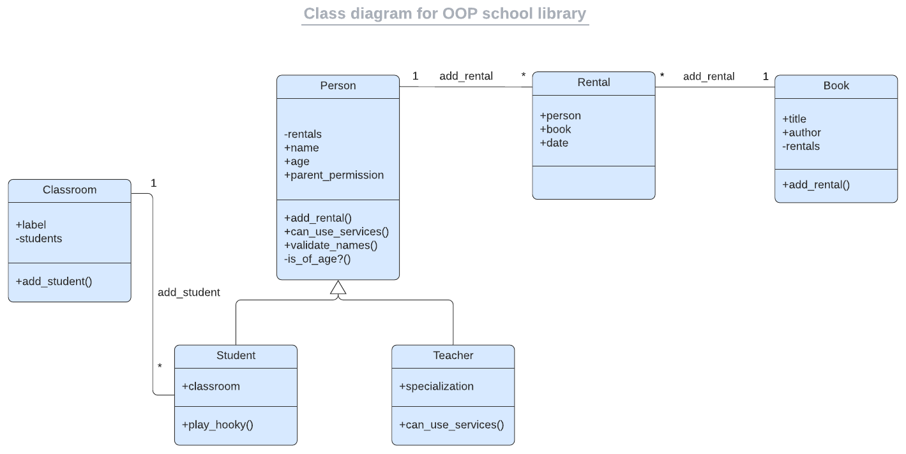
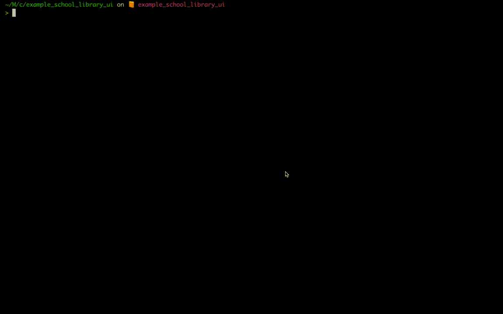

<a name="readme-top"></a>

<div align="center">

  
  <br/>

  <div align="center"><hr width="250px"/></div>

### Libray Manager
is a simple App created with Ruby using OOP (Object Oriented Programming) which enables you to record what books are in the library and who borrows them. The app allows you to:\
1️⃣ Add new students or teachers.\
2️⃣ Add new books.\
3️⃣ Save records of who borrowed a given book and when.

</div>

<div align="center"><hr width="250px"/></div>

# 📗 Table of Contents

- [📙 About the project](#about-project)
  - [How to do the App](#📈-UML-diagram)
  - [🛠 Built With](#built-with)
    - [Tech Stack](#tech-stack)
    - [Key Features](#key-features)
- [💻 Getting Started](#getting-started)
  - [Prerequisites](#prerequisites)
  - [Setup](#setup)
  - [Run](#run)
  - [Usage](#usage)
- [👥 Author](#authors)
- [🔭 Future Features](#future-features)
- [🤝 Contributing](#contributing)
- [⭐️ Show your support](#support)
- [🙏 Acknowledgements](#acknowledgements)
- [📝 License](#license)

<div align="center"><hr width="250px"/></div>

# 📙 Library Manager <a name="about-project"></a>

**Library Manager** is a simple App created with [Ruby Programming Language](https://www.ruby-lang.org/en/) using [OOP (Object Oriented Programming)](https://en.wikipedia.org/wiki/Object-oriented_programming) which enables you to record what books are in the library and who borrows them. The app allows you to:
   1. Add new students or teachers.
   2. Add new books.
   3. Save records of who borrowed a given book and when.


  - ### How to do the App <a name="how-to"></a>
    We will start by building the most essential pieces of the app(system). To do that, we will practice [Object Oriented Programming(OOP)](https://en.wikipedia.org/wiki/Object-oriented_programming). To build the app or system we will need to create the entities presented in the following **Class diagram**.

    - #### 📈 UML Class Diagram
      The image below is a [UML(Unified Modeling Language) class diagram](https://en.wikipedia.org/wiki/Class_diagram#Visibility), it can give you an overall idea of what we are going to build.

      

    - #### 🖥️ Simple UI (User Interface)
      Once you have the core part prepared, we will create a simple UI layer which will be a console app interacting with the user. The final result will be similar to the one presented in the demo below.

      

## 🛠 Built With <a name="built-with"></a>

- ### Tech Stack <a name="tech-stack"></a>

  <ul>
    <li>
      <a href="https://www.ruby-lang.org/en/">
      
      Ruby
      </a>
    </li>
  </ul>

<!-- Features -->

- ### Key Features <a name="key-features"></a>
  We'll be building the **Library Manager** app according to the following list of projects that will guide you through the steps described above. The details about each of these projects will be added on every feature implementation.

  <details> <!-- #start-first-project-description-->
    <summary>

    #### Project 1️⃣🔹Add <kbd>Person</kbd>, <kbd>Student</kbd>, and <kbd>Teacher</kbd> classes.
    </summary>

    Create in a separate file each of the below classes:

    #### ✳️ Class <kbd>Person</kbd> with the following:
    - Instance vars: `@id`, `@name`, and `@age`.
    - Constructor with `name`, `age`, and `parent_permission` as parameter. `name` and `parent_permission` are optional and have default values of `"Unknown"` and `true`.
    - Getters for `@id`, `@name`, and `@age`.
    - Setters for `@name` and `@age`.
    - Private method `of_age?` that returns `true` if `@age` is greater or equal to 18 and `false` otherwise.
    - Public method `can_use_services?` that returns `true` if person is of age 18 or if they have permission from parents.

    #### ✳️ Class <kbd>Student</kbd> with the following:
    - Inherits from <kbd>Person</kbd>.
    - Constructor extends parent's constructor by adding `@classroom` and a parameter for it.
    - Method `play_hooky` that returns `¯\(ツ)/¯`.

    #### ✳️ Class <kbd>Teacher</kbd> with the following:
    - Inherits from <kbd>Person</kbd>.
    - Constructor extends parent's constructor by adding `@specialization` and a parameter for it.
    - Override `can_use_services?` so it always returns `true`.
  </details> <!-- #end-first-project-description-->

  <details> <!-- #start-second-project-description-->
    <summary>

    #### 2️⃣ Use the <kbd>**Decorator**</kbd> design pattern.
    </summary>

    Think about how you can use two decorators in order to capitalize and trim people's names.

    #### ✳️ Interface
    - Create a class <kbd>Nameable</kbd>.
    - Implement a method called `correct_name` that will raise a `NotImplementedError`.

    #### ✳️ Turn your <kbd>Person</kbd> class to <kbd>Nameable</kbd>
    - Make sure that your <kbd>Person</kbd> class inherits from <kbd>Nameable</kbd>
    - Make sure that this class has a method `correct_name` implemented. It should simply return the `name` attribute.


    #### ✳️ Prepare base <kbd>Decorator</kbd>
    - Make sure that it inherits from <kbd>Nameable</kbd>.
    - In the constructor assign a nameable object from params to an instance variable.
    - Implement the `correct_name` method that returns the result of the `correct_name` method of the `@nameable`.


    #### ✳️ Prepare <kbd>CapitalizeDecorator</kbd> and <kbd>TrimmerDecorator</kbd>
    - For the <kbd>CapitalizeDecorator</kbd>:
      - Create a class that inherits from the base <kbd>Decorator</kbd> class.
      - Implement a method `correct_name` that capitalizes the output of `@nameable.correct_name`.
    - For the <kbd>TrimmerDecorator</kbd>:
      - Create a class that inherits from the base <kbd>Decorator</kbd> class.
      - Implement a method `correct_name` that makes sure that the output of `@nameable.correct_name` has a maximum of 10 characters. If it's longer it should trim the word.

    #### ✳️ See your `decorators` in action
    Try the following code and check if you managed to decorate your person:

    >```ruby
    >person = Person.new(22, 'maximilianus')
    >person.correct_name
    >capitalizedPerson = CapitalizeDecorator.new(person)
    >capitalizedPerson.correct_name
    >capitalizedTrimmedPerson = TrimmerDecorator.new(capitalizedPerson)
    >capitalizedTrimmedPerson.correct_name
    >```
  </details> <!-- #end-second-project-description-->

  <details> <!-- #start-third-project-description-->
    <summary>

    #### 3️⃣ Set up <kbd>Associations</kbd>.
    </summary>
    Now, we are going to finish creating the remaining <kbd>Classes</kbd> for our **Library Manager** and create the <kbd>Associations</kbd> between them.
    #### ✳️ Create a class <kbd>Classroom</kbd> with the following:
    - `@label` instance variable, should be initialized in the constructor.
    - Setter and getter for `@label` (remember about `attr_accessor`).
    #### ✳️ Create the `has-many`/`belongs-to` relationship between <kbd>Classroom</kbd> and <kbd>Student</kbd>.
    The following should be implemented:
    - Create the `has-many` side (a <kbd>Classroom</kbd> has many <kbd>Student</kbd>s).
    - Create the `belongs-to` side (a <kbd>Student</kbd> belongs to a <kbd>Classroom</kbd>).
    - Make sure that when adding a <kbd>Student</kbd> to a <kbd>Classroom</kbd> it also sets the <kbd>Classroom</kbd> for the <kbd>Student</kbd>.
    - Make sure that when setting the <kbd>Classroom</kbd> for a <kbd>Student</kbd> it also adds it to the <kbd>Classroom</kbd>s' <kbd>Student</kbd>s.
    #### ✳️ Create a class <kbd>Book</kbd> with the following:
    - `@title` and `@author` instance variables, should be initialized in the constructor.
    - Setters and getters for instance variables (remember about `attr_accessor`).
    #### ✳️ Create a class <kbd>Rental</kbd> with the following:
    - `@date` instance variable, should be initialized in the constructor.
    - Setter and getter for `@date` (remember about `attr_accessor`).
    #### ✳️ Create the `many-to-many` (also `has-many-through`) relationship between <kbd>Person</kbd> and <kbd>Book</kbd> using the intermediate class <kbd>Rental</kbd>.
    The following should be implemented:
    - Create the `has-many` side of <kbd>Book</kbd> and <kbd>Rental</kbd> (a <kbd>Book</kbd> has many <kbd>Rental</kbd>s).
    - Create the `belongs-to` side of <kbd>Rental</kbd> and <kbd>Book</kbd> (a <kbd>Rental</kbd> belongs to a <kbd>Book</kbd>).
    - Create the `has-many` side of <kbd>Person</kbd> and <kbd>Rental</kbd> (a <kbd>Person</kbd> has many <kbd>Rental</kbd>s).
    - Create the `belongs-to` side of <kbd>Rental</kbd> and <kbd>Person</kbd> (a <kbd>Rental</kbd> belongs to a <kbd>Person</kbd>).
    - Modify the constructor of <kbd>Rental</kbd> so <kbd>Book</kbd> and <kbd>Person</kbd> are set in it.
    #### ✳️ See the <kbd>Associations</kbd> in action
    A 'main.rb' was created on the 'root' folder, you can run it with `>ruby main.rb` to see how the associations work.
    ```ruby
    # a chemistry classroom is created
    chemistry = Classroom.new('chemistry')

    # a student is created, he is in chemistry classroom
    student = Student.new(22, 'maximilianus', false, chemistry)

    # a book1 is created, it hasn't been rented
    book1 = Book.new('chemistry for nubbies', 'ruth green')

    # a book2 is created, it hasn't been rented
    book2 = Book.new('chemistry advanced', 'john fitzgerald')

    # a teacher is created, with chemistry specialization
    teacher = Teacher.new(22, 'mr. smith', 'chemistry')

    # teacher rents book1 on may 25, 2023
    teacher.add_rental('05/25/2023', book1)

    # book2 is rented by student on may 25, 2023
    book2.add_rental('05/25/2023', student)
    ```
    The result of the previous code once you ran it should be:
    ```sh
    ❯ ruby main.rb
    ---- create a classroom ---
    classroom: chemistry
    classroom students: []

    ---- create a student ---
    student: maximilianus
    student classroom: chemistry
    student rentals: []

    ...
    ...
    ```
  </details> <!-- #end-third-project-description-->

  <details> <!-- #start-fourth-project-description-->
    <summary>

    #### 4️⃣ Add basic UI.
    </summary>

    This time we will create a form of <kbd>UI</kbd>(`User Interface`) for our **Library Manager**. This way it can be invoked as an **executable** and not something you use in `IRB` exclusively.
    #### ✳️ Watch this <kbd>Console App Example</kbd>.
    Our **Library Manager** should behave in the same way as in the following example.
    
    #### ✳️ The `entry-point`
    - Create a `app.rb` file that will serve as your console app `entry-point`. It should have methods that do the following:
      - List all <kbd>Book</kbd>s.
      - List all people.
      - Create a <kbd>Person</kbd> (<kbd>Teacher</kbd> or <kbd>Student</kbd>, not a plain <kbd>Person</kbd>).
      - Create a <kbd>Book</kbd>.
      - Create a <kbd>Rental</kbd>.
      - List all <kbd>Rental</kbd>s for a given <kbd>Person</kbd> `@id`.
    #### ✳️ The `script`
    - In your `main.rb` define the `entry-point`, this will be a method called `main` that is invoked at the end of your file. This method should do the following:
      - Present the user with a list of options to perform.
      - Lets users choose an option.
      - If needed, ask for parameters for the option.
      - Have a way to quit the app.
    #### ✳️ Starting the <kbd>UI</kbd>
    - Run the app with the following `command`:
      ```sh
      > main
      ```
    - The app will show the main menu in the console
      ```sh
      Welcome! This is the 'Library Manager'
      Please choose an option by entering a number:
      1 - List all books
      2 - List all people
      3 - Create a person
      4 - Create a book
      5 - Create a rental
      6 - List all rentals for a given person
      7 - Exit
      ```
  </details> <!-- #end-fourth-project-description-->

  <details> <!-- #start-tobe-implemented-features-->
    <summary>

    #### 🧑‍💻 to be implemented Features
    </summary>

    #### Project 5️⃣🔹 Refactoring the code.
    #### Project 6️⃣🔹Preserve data.
    #### Project 7️⃣🔹Unit Tests.
  </details> <!-- #end-tobe-implemented-features-->


<p align="right">(<a href="#readme-top">back to top</a>)</p>

<!-- LIVE DEMO

## 🚀 Live Demo <a name="live-demo"></a>

> Add a link to your deployed project.

- [Live Demo Link](<replace-with-your-deployment-URL>)

<p align="right">(<a href="#readme-top">back to top</a>)</p>
-->
<!-- GETTING STARTED -->

## 💻 Getting Started <a name="getting-started"></a>

To get a local copy of this project up and running, follow these steps.

- ### Prerequisites

   - In order to run this project locally you need `git` installed. Please got to [Getting Started - Installing Git guide](https://git-scm.com/book/en/v2/Getting-Started-Installing-Git) and follow the steps described for your system to install `git`.
   - Also you must have `Ruby` installed, you can go to the [Installing Ruby](https://www.ruby-lang.org/en/documentation/installation/) documentation and follow the steps for your computer OS.


- ### Setup
    Clone this repository to your desired folder:
    ```sh
    cd my-folder
    git clone git@github.com:luigirazum/library-manager.git
    ```
- ### Usage
    In the folder where you cloned the project, go into the project folder
    ```sh
    cd library-manager
    ```
- ### Run
    In the `library-manager` folder, use the following code to run the app
    ```rb
    ruby main.rb
    ```

<p align="right">(<a href="#readme-top">back to top</a>)</p>
<!-- AUTHORS -->

## 👥 Author <a name="authors"></a>

👨‍💻 **Luis Zubia**

<ul>
  <li>
      <a href="https://github.com/luigirazum">
      
      Github: <b>@luigirazum</b>
      </a>
    </li>
    <li>
      <a href="https://twitter.com/LuigiRazum">
      
      Twitter: <b>@LuigiRazum</b>
      </a>
    </li>
    <li>
      <a href="https://linkedin.com/in/luiszubia">
      
      LinkedIn: <b>Luis Zubia</b>
      </a>
    </li>
</ul>

<p align="right">(<a href="#readme-top">back to top</a>)</p>

<!-- FUTURE FEATURES -->

## 🔭 Future Features <a name="future-features"></a>

<details>
  <summary>

  #### ➕ Sorting and Ordering.
  </summary>

  - ❇️ Implement sorting and ordering options for the library data, such as sorting books by title, author, or publication date.
  - ❇️ Make it easier for users to navigate and browse the library's collection.
</details>

<details>
  <summary>

  #### ➕ Reporting Capabilities.
  </summary>

  - ❇️ Develop features that allow users to generate reports or summaries of the library's data, such as a list of borrowed books, overdue books, or books by genre.
  - ❇️ Facilitate better management and analysis of the library's collection and borrowing patterns.
</details>

<details>
  <summary>

  #### ➕ Export and Import Functionality.
  </summary>

  - ❇️ Add the ability to export library data to a file or import data from an external source.
  - ❇️ Allow users to create backups of the library records or import data from other libraries or systems.
</details>
<p align="right">(<a href="#readme-top">back to top</a>)</p>

<!-- CONTRIBUTING -->

## 🤝 Contributing <a name="contributing"></a>

Contributions, issues, typos, and feature requests are welcome!

Feel free to check the [issues page](../../issues/).

<p align="right">(<a href="#readme-top">back to top</a>)</p>

<!-- SUPPORT -->

## ⭐️ Show your support <a name="support"></a>

If you like this project, your support giving a ⭐ will be highly appreciated.

<p align="right">(<a href="#readme-top">back to top</a>)</p>

<!-- ACKNOWLEDGEMENTS -->

## 🙏 Acknowledgments <a name="acknowledgements"></a>

- I would like to thank [Yukihiro “Matz” Matsumoto](http://www.rubyist.net/~matz/) for creating the [Ruby Programming Language](https://www.ruby-lang.org/en/).

<p align="right">(<a href="#readme-top">back to top</a>)</p>

<!-- FAQ (optional)

## ❓ FAQ <a name="faq"></a>

> Add at least 2 questions new developers would ask when they decide to use your project.

- **[Question_1]**

  - [Answer_1]

- **[Question_2]**

  - [Answer_2]

<p align="right">(<a href="#readme-top">back to top</a>)</p>
-->
<!-- LICENSE -->

## 📝 License <a name="license"></a>

This project is [MIT](./LICENSE) licensed.

<p align="right">(<a href="#readme-top">back to top</a>)</p>
